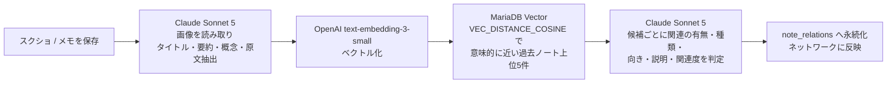
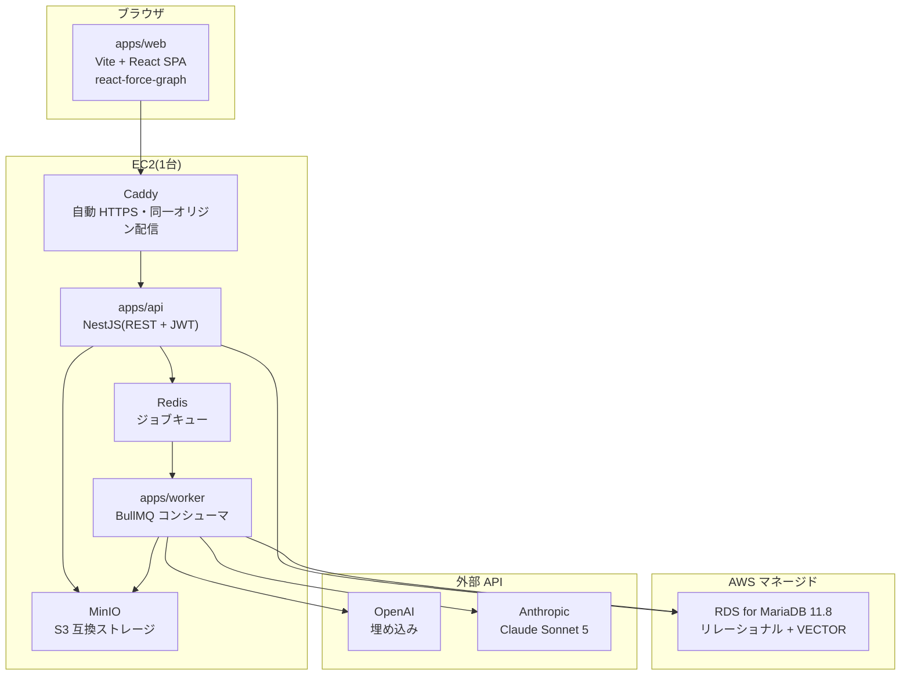

# SecondBrain

**スクリーンショットを「貼るだけ」で、AI が知識ネットワークを育てる個人向けナレッジアプリ。**

保存した情報は、たいてい二度と見返されない。SecondBrain は「保存する行為」と「知識として活用する行為」の分断を、AI による自動構造化で埋める。

目指す体験に最も近い既存サービスは **TheBrain**。ただし TheBrain がノードと関係をユーザーの手作業で作るのに対し、**SecondBrain はその構築を AI が肩代わりする**。ここが本質的な違いである。

---

## デモ

**https://secondbrain-msk.duckdns.org/**

> 審査用アカウントは提出時に別途お伝えします。料理を題材にしたサンプル17件を投入済み。

**まず [`/network`](https://secondbrain-msk.duckdns.org/network) を開いてほしい。** そこがこのアプリの中心体験になる。

見どころ:

| | 何が見えるか |
|---|---|
| **ノードの大きさ** | 接続数。「料理の基本」が最大のハブとして自動的に浮かび上がる |
| **線の太さ** | AI が判定した関連度(0〜1) |
| **矢印** | 関係の向き。「料理 → 肉料理 → ハンバーグ」と抽象から具体へたどれる |
| **線をクリック** | **なぜつながったのかの AI 説明**が日本語で出る |
| **孤立したノード** | 「靴紐の結び方」「加湿器の掃除」は意図的に無関係な題材。**何でも繋げる雑な AI ではない**ことの提示 |
| **トグル** | 「関係のあるノートのみ表示」で孤立ノードを隠せる |
| **ノートを保存** | `/network` を開いたまま、**ノードと関係線が増える** |

---

## AI が自動で行うこと

ノートを保存すると、非同期ワーカーが以下を順に実行する。ユーザーの操作は「貼る」だけ。



関係の種類は7値の固定語彙で表現する。自由記述にせず語彙を固定したのは、可視化で色分け・意味づけができ、AI の出力を機械的に検証できるようにするため。

`same-theme` / `cause-solution` / `claim-counter` / `concept-hierarchy` / `tech-example` / `problem-remedy` / `other`

---

## アーキテクチャ



`packages/shared` に **ts-rest** の API 契約を置き、`apps/api` と `apps/web` が同じ型定義を共有する。契約を変更すると両側で型エラーが出るため、フロントとバックの乖離がビルド時に検出される。

web と api は Caddy 経由で**同一オリジン**に載せている(`/api/*` を api へリバースプロキシ)。CORS もミックスドコンテンツも発生しない。

---

## 技術選定と、その理由

| 領域 | 採用 | 理由 |
|---|---|---|
| 言語 | TypeScript 統一 | フロント・API・ワーカー・共有パッケージすべてで型を一本化する |
| 構成 | 分離型モノレポ(SPA + NestJS + ワーカー) | 中心体験のグラフ描画は SSR 不要の純クライアント処理。Next.js だと主要画面で `ssr: false` の管理を引きずる。一方 AI パイプラインは NestJS の BullMQ 統合・スケジューラが公式装備 |
| DB | **MariaDB 11.8** | ネイティブ `VECTOR` 型と `VEC_DISTANCE_COSINE` を持ち、**リレーショナルデータとベクトル検索を1つの DB で完結**できる。専用ベクトルストアを別立てせずに済み、運用対象が1つ減る。RDS でのマネージド運用も可能 |
| ORM | Drizzle ORM | VECTOR 型のような方言を raw SQL で素直に扱える([ADR-0101](docs/adr/0101-orm-and-type-sharing.md)) |
| 型共有 | ts-rest | 分離型でも端から端まで型を共有する([ADR-0101](docs/adr/0101-orm-and-type-sharing.md)) |
| 埋め込み | OpenAI `text-embedding-3-small` | Anthropic に埋め込み専用エンドポイントが無いため。安価で MariaDB VECTOR と整合 |
| 生成 | Claude Sonnet 5 | 画像解析と関係判定の両方。構造化出力を JSON Schema で拘束し、クライアント側で Zod 再検証する |
| 可視化 | react-force-graph | 2D/3D 互換 API。2D 実装のまま 3D へ昇格できる形を保つ |
| 非同期 | BullMQ + Redis | AI 処理は数秒〜数十秒かかるため、保存レスポンスから切り離す |
| インフラ | EC2 1台 + RDS | 個人開発のコストを優先。Redis と MinIO はホスト上の Docker Compose |

ベクトル検索の実機検証結果は [ADR-0102](docs/adr/0102-vector-search-poc-result.md) にある。

---

## 設計上、特に判断が要った点

### 投入順がネットワークの形を決める

候補検索は「意味的に近い既存ノート上位5件」を**しきい値なし**で返す。閾値を設けなかったのは、「関連あり/なし」の判断を数値ではなく AI に委ねるほうが説明可能性が高いため。結果として1件目は候補ゼロでエッジが張られない — これは正常な挙動である。

### エッジの一意性

`CHECK(note_a_id < note_b_id)` + `UNIQUE(user_id, note_a_id, note_b_id)` でキー構造として1組1行に正規化し、逆順重複を発生させない。関係の向きは別カラム `type_direction` に持たせる。

### AI 出力の境界検証

Claude の応答は必ずクライアント境界で検証・正規化してから DB へ書く。語彙外の `type` は `other` へ丸め、`relatedness` は 0〜1 へ clamp、`description` は500文字で切り詰める。**入力していない候補 ID が混ざった場合は破棄せず判定失敗として扱う** — 静かに部分適用するほうが危険だという判断。

### 陳腐化の検知

エッジは両端ノートの `embedding_fingerprint` を保持する。片方が編集されれば fingerprint が変わり、その関係が古くなったことを検知できる。生成元ノートの ID だけでは相手側の編集を追えないため、後から追加できない情報として最初から持たせている。

---

## 品質への取り組み

| | |
|---|---|
| テスト | Vitest(全ワークスペース統一)+ 統合テスト(Docker Compose 上の実 DB) |
| 静的解析 | ESLint 9 flat config + typescript-eslint、`sonarjs`(複雑度・バグパターン)、`security`(Node の危険パターン)、`jsx-a11y`(アクセシビリティ) |
| カバレッジ | 全体はパッケージ単位の閾値で後退を禁止。**変更行は CI で 100% を必須**(`diff-cover`) |
| 重複検知 | jscpd(既定ブランチの実測値を閾値に設定) |
| シークレット | secretlint による全体スキャン + pre-commit フックでの staged スキャン |
| CI | GitHub Actions(`.github/workflows/ci.yml`) |
| 独立レビュー | 実装したモデルとは別系統のモデルによるコードレビューを、発見(D0)→ 修正検証(R1/R2)のモデルで実施 |

---

## ローカルでの起動

前提: Node.js 24 / pnpm(corepack)/ Docker

```bash
pnpm install

cp .env.example .env    # 必要な値を埋める(JWT_SECRET・AI キー等)
docker compose up -d    # MariaDB / Redis / MinIO

pnpm db:migrate
pnpm db:seed            # .env の SEED_USER_EMAIL / SEED_USER_PASSWORD でユーザー作成

# 3つのプロセスを別々のターミナルで起動する
pnpm --filter web dev            # http://localhost:5173
pnpm --filter api start:dev
pnpm --filter worker start:dev
```

主なコマンド:

```bash
pnpm test          # Vitest
pnpm typecheck     # tsc --noEmit
pnpm lint          # ESLint
pnpm build         # 依存順にビルド
pnpm poc:vector    # MariaDB VECTOR 型の動作確認
```

`.env` の各項目は [`.env.example`](.env.example) を参照。

---

## デプロイ

EC2 1台 + RDS 構成。手順は [docs/deployment.md](docs/deployment.md)、実行は [`deploy/deploy.sh`](deploy/deploy.sh)。

デプロイスクリプトは各段で成果物の実在を検証する。特に、Vite がビルド時に埋め込む `VITE_API_BASE_URL` が正しく焼き込まれたかを**ビルド後のバンドルを grep して確認**している。ここを取り違えると「画面は出るが API 呼び出しが全部失敗する」という気づきにくい壊れ方をするため。

---

## 現在のスコープと、割り切ったこと

MVP の範囲を明示しておく。

**実装済み**: スクショ取り込みと AI 解析 / メモ作成 / 埋め込み生成 / 類似候補探索 / 関係の自動生成 / 2D 知識ネットワークビュー / JWT 認証

**MVP 外(将来構想)**: URL 取り込み / 統合検索 / 3D 表示(ストレッチ)/ エンティティページ / 階層クラスタリング / セルフ登録 UI(現在はシードによる作成のみ)

**既知の割り切り**:

- **レート制限が未実装。** 公開直後の対応事項として認識している
- **CSP を意図的に未設定。** react-force-graph が canvas / worker / blob URL を使うため、実機検証なしに制限を入れるとネットワークビューが本番でだけ壊れる。段階的に導入する
- **ランタイム用の最小権限 DB ユーザーを分離していない。** 提出直前にデプロイ経路を作り替えるリスクのほうが大きいと判断し、リスク受容として記録した

割り切りは記録して Issue 化してあり、判断の経緯は [docs/adr/](docs/adr/) と要件定義書の未決事項表に残している。

---

## ドキュメント

| | |
|---|---|
| [docs/requirements.md](docs/requirements.md) | 要件定義。目的・MVP スコープ・技術選定の判断・未決事項 |
| [docs/features/F-7.md](docs/features/F-7.md) | スクショ AI 解析の機能仕様 |
| [docs/features/F-20.md](docs/features/F-20.md) | 知識ネットワークビューの機能仕様 |
| [docs/deployment.md](docs/deployment.md) | 初回デプロイ手順 |
| [docs/adr/](docs/adr/) | アーキテクチャ決定記録 |
