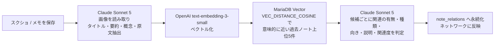
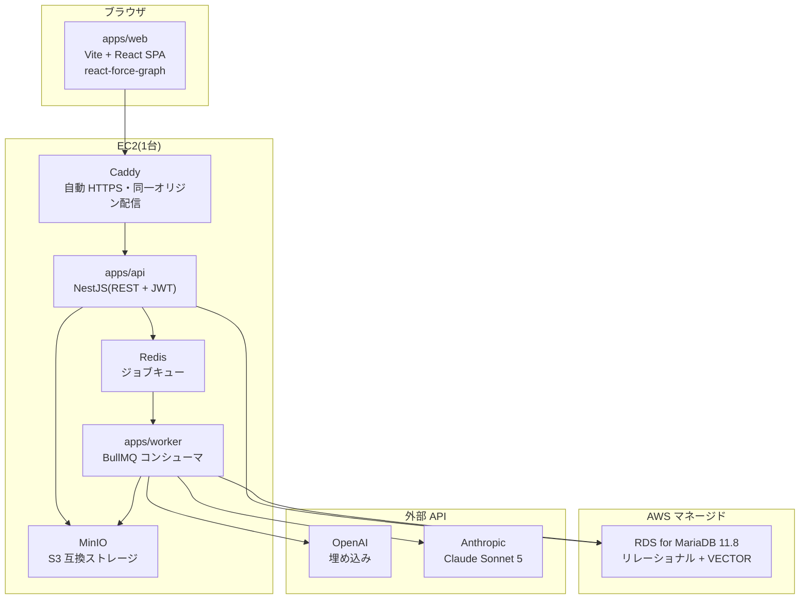

# SecondBrain

**スクリーンショットを「貼るだけ」で、AI が知識ネットワークを育てる個人向けナレッジアプリ。**

保存した情報は、たいてい二度と見返されない。SecondBrain は「保存する行為」と「知識として活用する行為」の分断を、AI による自動構造化で埋める。

目指す体験に最も近い既存サービスは **TheBrain**。ただし TheBrain がノードと関係をユーザーの手作業で作るのに対し、**SecondBrain はその構築を AI が肩代わりする**。ここが本質的な違いである。

---

## デモ

**https://secondbrain-msk.duckdns.org/**

> 審査用アカウントは提出時に別途お伝えします。料理を題材にしたサンプル17件を投入済み。

**まず [`/network`](https://secondbrain-msk.duckdns.org/network) を開いてほしい。** そこがこのアプリの中心体験になる。

入口は**スクリーンショット1枚**である。貼るだけで、数十秒後にはタイトル・要約・概念が生成され、過去ノートとの関係まで判定されて `/network` にノードと線が増える。ユーザーが書く・分類する・繋ぐ作業は無い。

**貼る(入口)→ 繋がる(中心)→ 眠って整理される(後述の「睡眠」)** — これがこのアプリの全体像である。

見どころ:

| | 何が見えるか |
|---|---|
| **ノードの大きさ** | 接続数。「料理の基本」が最大のハブとして自動的に浮かび上がる |
| **線の太さ・濃さ** | AI が判定した関連度(0〜1)。関連が強いほど太く濃い |
| **矢印** | 関係の向き。「料理 → 肉料理 → ハンバーグ」と抽象から具体へたどれる |
| **線をクリック** | **なぜつながったのかの AI 説明**が日本語で出る。両端のノート名も並び、そこから相手のノートへ移動できる |
| **孤立したノード** | 「靴紐の結び方」「加湿器の掃除」は意図的に無関係な題材。**何でも繋げる雑な AI ではない**ことの提示 |
| **トグル** | 「関係のあるノートのみ表示」で孤立ノードを隠せる |
| **ノートを保存** | `/network` を開いたまま、**ノードと関係線が増える** |

---

## AI が自動で行うこと

ノートを保存すると、非同期ワーカーが以下を順に実行する。ユーザーの操作は「貼る」だけ。



関係の種類は7値の固定語彙で表現する。自由記述にせず語彙を固定したのは、可視化で色分け・意味づけができ、AI の出力を機械的に検証できるようにするため。

`same-theme` / `cause-solution` / `claim-counter` / `concept-hierarchy` / `tech-example` / `problem-remedy` / `other`

---

## なぜ「SecondBrain」なのか — 睡眠する知識ベース

人間の脳は、起きている間に取り込んだ情報を**睡眠中に整理し、記憶同士を結び直す**。SecondBrain の設計思想はここにある。

| 脳の働き | アプリでの対応 | 状態 |
|---|---|---|
| 連想記憶 | 保存時に過去ノートとの関係を自動生成する | **実装済み** |
| フォルダではなくネットワーク | AI による自動構造化とグラフ探索 | **実装済み** |
| **睡眠中の記憶整理** | **毎晩バッチが既存ノート同士の関係を評価し直し、保存時には見つからなかった繋がりを提案する** | **将来実装(F-16)** |

保存時の関係生成は「その時点で存在した過去ノート」しか見ない。後から入ってきたノートが古いノートの意味を変えても、それは検知できない — これは**設計上の限界であって、バグではない**。夜間バッチはこの限界を、脳と同じやり方で埋める。

エッジが両端ノートの `embedding_fingerprint` を持っている(後述の「陳腐化の検知」)のは、この再評価を後から追加できるようにするための布石でもある。

実行基盤自体は既に本番で動いている。BullMQ の repeatable job による夜間 cron は [`note-purge`](apps/worker/src/queues/note-purge/note-purge.producer.ts)(毎日 03:00 UTC)・[`note-stuck-requeue`](apps/worker/src/queues/note-stuck-requeue/note-stuck-requeue.producer.ts)(10分毎)として稼働しており、関係再評価ジョブは同じ仕組みに乗る。

---

## アーキテクチャ



`packages/shared` に **ts-rest** の API 契約を置き、`apps/api` と `apps/web` が同じ型定義を共有する。契約を変更すると両側で型エラーが出るため、フロントとバックの乖離がビルド時に検出される。

web と api は Caddy 経由で**同一オリジン**に載せている(`/api/*` を api へリバースプロキシ)。CORS もミックスドコンテンツも発生しない。

---

## 技術選定と、その理由

| 領域 | 採用 | 理由 |
|---|---|---|
| 言語 | TypeScript 統一 | フロント・API・ワーカー・共有パッケージすべてで型を一本化する |
| 構成 | 分離型モノレポ(SPA + NestJS + ワーカー) | 中心体験のグラフ描画は SSR 不要の純クライアント処理。Next.js だと主要画面で `ssr: false` の管理を引きずる。一方 AI パイプラインは NestJS の BullMQ 統合・スケジューラが公式装備 |
| DB | **MariaDB 11.8** | ネイティブ `VECTOR` 型と `VEC_DISTANCE_COSINE` を持ち、**リレーショナルデータとベクトル検索を1つの DB で完結**できる。専用ベクトルストアを別立てせずに済み、運用対象が1つ減る。RDS でのマネージド運用も可能 |
| ORM | Drizzle ORM | VECTOR 型のような方言を raw SQL で素直に扱える([ADR-0101](docs/adr/0101-orm-and-type-sharing.md)) |
| 型共有 | ts-rest | 分離型でも端から端まで型を共有する([ADR-0101](docs/adr/0101-orm-and-type-sharing.md)) |
| 埋め込み | OpenAI `text-embedding-3-small` | Anthropic に埋め込み専用エンドポイントが無いため。安価で MariaDB VECTOR と整合 |
| 生成 | Claude Sonnet 5 | 画像解析と関係判定の両方。構造化出力を JSON Schema で拘束し、クライアント側で Zod 再検証する |
| 可視化 | react-force-graph | 2D/3D 互換 API。2D 実装のまま 3D へ昇格できる形を保つ |
| 非同期 | BullMQ + Redis | AI 処理は数秒〜数十秒かかるため、保存レスポンスから切り離す |
| インフラ | EC2 1台 + RDS | 個人開発のコストを優先。Redis と MinIO はホスト上の Docker Compose |

ベクトル検索の実機検証結果は [ADR-0102](docs/adr/0102-vector-search-poc-result.md) にある。

---

## 設計上、特に判断が要った点

### 投入順がネットワークの形を決める

候補検索は「意味的に近い既存ノート上位5件」を**しきい値なし**で返す。閾値を設けなかったのは、「関連あり/なし」の判断を数値ではなく AI に委ねるほうが説明可能性が高いため。結果として1件目は候補ゼロでエッジが張られない — これは正常な挙動である。

### エッジの一意性

`CHECK(note_a_id < note_b_id)` + `UNIQUE(user_id, note_a_id, note_b_id)` でキー構造として1組1行に正規化し、逆順重複を発生させない。関係の向きは別カラム `type_direction` に持たせる。

### AI 出力の境界検証

Claude の応答は必ずクライアント境界で検証・正規化してから DB へ書く。語彙外の `type` は `other` へ丸め、`relatedness` は 0〜1 へ clamp、`description` は500文字で切り詰める。**入力していない候補 ID が混ざった場合は破棄せず判定失敗として扱う** — 静かに部分適用するほうが危険だという判断。

### 陳腐化の検知

エッジは両端ノートの `embedding_fingerprint` を保持する。片方が編集されれば fingerprint が変わり、その関係が古くなったことを検知できる。生成元ノートの ID だけでは相手側の編集を追えないため、後から追加できない情報として最初から持たせている。

### 可視化は「描けている」と「操作できる」が別問題

力学レイアウトでは接続数の多いノードの円が線を覆う。さらに、線の当たり判定は画面 px でほぼ一定なのに対し、ノードの判定半径はグラフ座標で持つためズームアウトすると画面上で小さくなる — **判定の単位が違う**。結果として「線を狙うとノードが取れる」「引くとノードが押せない」という、実機を触るまで表面化しない不具合になった。

対処は `nodePointerAreaPaint` で**シャドウキャンバス側にのみ**画面 px 下限つきの判定円を描くこと。**見た目の円の大きさは変えずに**、どの倍率でもノードが線に勝つ的の大きさを確保する。あわせてノード円を縮小して線の露出を作り、ラベルには背景板を敷いて線や円と重なっても読めるようにした。ノード半径の比(= 接続数の表現)は共通の乗数を変えているだけなので保たれる。

---

## 品質への取り組み

| | |
|---|---|
| テスト | Vitest(全ワークスペース統一)+ 統合テスト(Docker Compose 上の実 DB) |
| 静的解析 | ESLint 9 flat config + typescript-eslint、`sonarjs`(複雑度・バグパターン)、`security`(Node の危険パターン)、`jsx-a11y`(アクセシビリティ) |
| カバレッジ | 全体はパッケージ単位の閾値で後退を禁止。**変更行は CI で 100% を必須**(`diff-cover`) |
| 重複検知 | jscpd(既定ブランチの実測値を閾値に設定) |
| シークレット | secretlint による全体スキャン + pre-commit フックでの staged スキャン |
| CI | GitHub Actions(`.github/workflows/ci.yml`) |
| 独立レビュー | 実装したモデルとは別系統のモデルによるコードレビューを、発見(D0)→ 修正検証(R1/R2)のモデルで実施 |

---

## ローカルでの起動

前提: Node.js 24 / pnpm(corepack)/ Docker

```bash
pnpm install

cp .env.example .env    # 必要な値を埋める(JWT_SECRET・AI キー等)
docker compose up -d    # MariaDB / Redis / MinIO

pnpm db:migrate
pnpm db:seed            # .env の SEED_USER_EMAIL / SEED_USER_PASSWORD でユーザー作成

# 3つのプロセスを別々のターミナルで起動する
pnpm --filter web dev            # http://localhost:5173
pnpm --filter api start:dev
pnpm --filter worker start:dev
```

主なコマンド:

```bash
pnpm test          # Vitest
pnpm typecheck     # tsc --noEmit
pnpm lint          # ESLint
pnpm build         # 依存順にビルド
pnpm poc:vector    # MariaDB VECTOR 型の動作確認
```

`.env` の各項目は [`.env.example`](.env.example) を参照。

---

## デプロイ

EC2 1台 + RDS 構成。手順は [docs/deployment.md](docs/deployment.md)、実行は [`deploy/deploy.sh`](deploy/deploy.sh)。

デプロイスクリプトは各段で成果物の実在を検証する。特に、Vite がビルド時に埋め込む `VITE_API_BASE_URL` が正しく焼き込まれたかを**ビルド後のバンドルを grep して確認**している。ここを取り違えると「画面は出るが API 呼び出しが全部失敗する」という気づきにくい壊れ方をするため。

---

## 現在のスコープと、割り切ったこと

MVP の範囲を明示しておく。

**実装済み**: スクショ取り込みと AI 解析 / メモ作成 / 埋め込み生成 / 類似候補探索 / 関係の自動生成 / 2D 知識ネットワークビュー / JWT 認証

**MVP 外**: 下の「[将来実装予定の機能](#将来実装予定の機能)」に一覧する。

**既知の割り切り**:

- **レート制限が未実装。** 公開直後の対応事項として認識している
- **CSP を意図的に未設定。** react-force-graph が canvas / worker / blob URL を使うため、実機検証なしに制限を入れるとネットワークビューが本番でだけ壊れる。段階的に導入する
- **ランタイム用の最小権限 DB ユーザーを分離していない。** 提出直前にデプロイ経路を作り替えるリスクのほうが大きいと判断し、リスク受容として記録した

割り切りは記録して Issue 化してあり、判断の経緯は [docs/adr/](docs/adr/) と要件定義書の未決事項表に残している。

---

## 将来実装予定の機能

MVP に入れなかったものは、構想ではなく**優先度と要件 ID を持った残作業**として管理している(ID は [docs/requirements.md](docs/requirements.md) の機能要件表に対応)。

### 取り込みを広げる

| 機能 | ID | 内容 |
|---|---|---|
| URL 取り込み + 本文アーカイブ | F-1 | URL を貼ると本文を抽出して要約する。**本文もアーカイブとして保存**し、元記事が消えてもノート内で読める |
| ノートのエクスポート | F-6 | 知識資産の可搬性を確保する。溜めた知識をこのアプリに囲い込まない |

### 想起を強くする

| 機能 | ID | 内容 |
|---|---|---|
| セマンティック検索 | F-8 | タグ・全文検索に加え、自然文をそのまま打てる検索を1つのボックスで提供する。埋め込みは既にあるため土台は揃っている |
| 再浮上・ダイジェスト | F-9 | 一定期間参照していないノートをホームに再提示する。週次/月次ダイジェスト |
| 風化と強化 | F-10 | 参照履歴を記録し、よく参照するものは目立ち、参照されないものは背景に退く。忘却もまた脳の機能である |
| 埋め込みの保守 | F-21 | 未生成・旧バージョンの埋め込みを冪等に一括再生成する。将来の埋め込みモデル交換もこの経路で行う |
| エッジの手直し | F-22 | 関係の種類・説明のユーザー編集・削除・再有効化。**ユーザーが直した値は自動再生成で上書きしない** |

### 構造を深くする

| 機能 | ID | 内容 |
|---|---|---|
| **睡眠中の記憶整理** | F-16 | 毎晩バッチで既存ノート同士の新しい繋がりを提案する(前述)。マネタイズの中心でもある |
| エンティティ正規化・エンティティページ | F-11 | 「Postgres / PostgreSQL / ポスグレ」の表記ゆれを吸収して同一概念に統合し、情報源を問わず集約表示する |
| 階層型知識マップ | F-12 | 「抽象領域 → トピック → 細粒度」を自動クラスタリングで構築する。**階層の深さは固定せず、情報量の増加に応じて自動で細分化される** |
| 3D 脳ビュー | F-13 | 階層マップを 3D 球体ネットワークとして描画し、球体サイズ=情報量、参照頻度を明るさに反映する。react-force-graph を選んだのは 2D/3D の API 互換でここへ昇格できるため |
| NotebookLM 用プロンプト出力 | F-15 | 選んだ繋がりのノート群を NotebookLM へ貼れる形に整形する。個人向け API が無いため手動貼り付け前提 |

### 公開する

| 機能 | ID | 内容 |
|---|---|---|
| **アカウント登録(セルフサインアップ)** | F-17 | メールアドレスとパスワードで自分でアカウントを作れるようにする。**現在はシードによるユーザー作成のみ**で、登録用のエンドポイントも画面も持っていない |
| **ログイン機能の拡充** | F-17 | ログイン自体は実装済み(email + password → JWT + `RequireAuth` による画面保護)。一般公開にあたり**メールアドレス確認・パスワードリセット・ソーシャルログイン**を追加する |
| ユーザーごとの利用量上限 | F-18 | 月あたりの取り込み件数・AI 生成回数に上限を設けてコスト暴走を防ぐ。マネタイズの前提基盤でもある |

公開運用に必要な**レート制限・CSP・最小権限 DB ユーザーの分離**は、上記の機能とは別に「割り切り」として Issue 化してある。

---

## マネタイズ

無料プランでも機能そのものは削らない。課金の線は**実行頻度**に引く。

| | 無料 | プレミアム(構想) |
|---|---|---|
| 保存時の関係生成 | 利用量上限の範囲で無制限 | 同じ |
| 夜間の自動再整理(睡眠) | 毎晩 | 毎晩 |
| **任意タイミングでの再整理** | — | **いつでも実行できる** |
| 月あたりの取り込み・AI 生成回数(F-18) | 上限あり | 上限を引き上げる |

理由は単純で、**このアプリの変動費はほぼ AI API 呼び出しに集約されている**からである。関係の再整理は全ノートを対象に Claude を回す最もコストの高い処理であり、任意タイミングでの実行を許すとコストがユーザー操作へ直結する。

つまり「機能を人質にして有料にする」のではなく、「**実際に費用が発生する操作を有料側に置く**」。この形なら課金理由をユーザーに説明でき、無料ユーザーの体験も損なわない。上限管理(F-18)は無料・有料のどちらにも必要な基盤であり、MVP 外でも優先度 Must として残しているのはそのためである。

大量にノートを入れた直後に「寝るのを待たず、いま脳を整理させたい」という要求は自然に発生する。そこが最初の課金ポイントになる。

---

## ドキュメント

| | |
|---|---|
| [docs/requirements.md](docs/requirements.md) | 要件定義。目的・MVP スコープ・技術選定の判断・未決事項 |
| [docs/features/F-7.md](docs/features/F-7.md) | スクショ AI 解析の機能仕様 |
| [docs/features/F-20.md](docs/features/F-20.md) | 知識ネットワークビューの機能仕様 |
| [docs/deployment.md](docs/deployment.md) | 初回デプロイ手順 |
| [docs/adr/](docs/adr/) | アーキテクチャ決定記録 |
